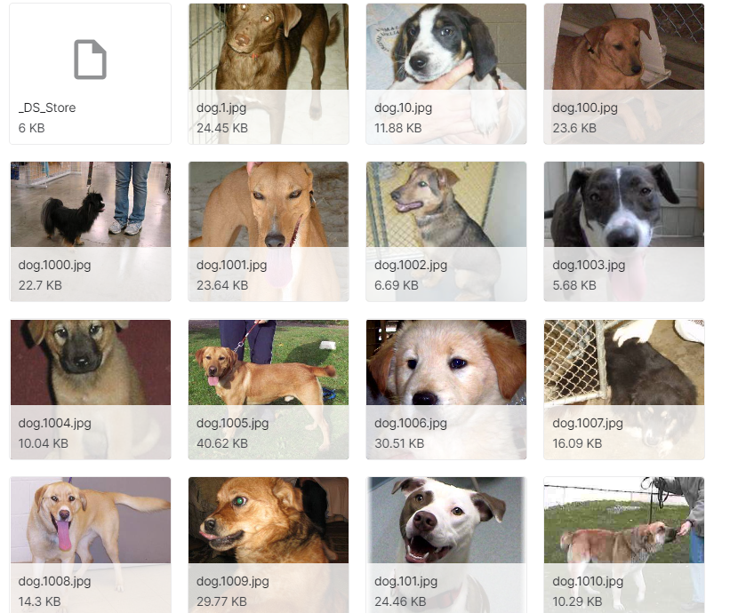
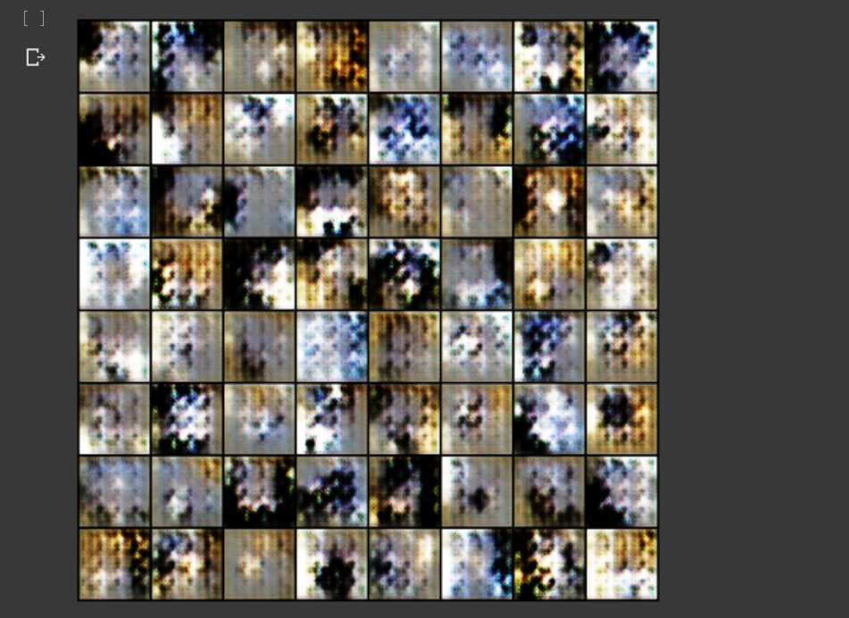
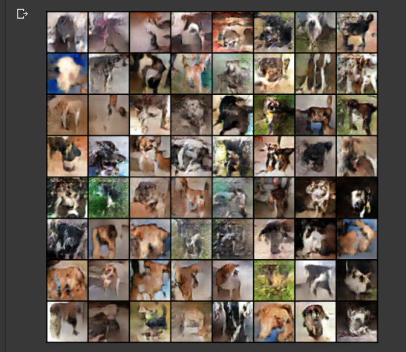

# DCGAN
Dog Image Generating (DCGAN) (2020.06.29)  

2020년도 1학기 '인공지능의이해와활용' 수업 최종 과제로 딥러닝 기술을 활용한 자유주제 프로젝트가 있었다. 
DCGAN을 활용하여 새로운 개 이미지 생성을 프로젝트 목표로 하였다.  

DCGAN은 Convolutional layer를 GAN 네트워크에 적용시킨 구조를 갖는다. 
### DCGAN의 특징
- 기존 GAN에서 Linear Layer와 Pooling Layer 최대한 배제  
- Discriminator는 Convolutional Layer를 사용하여 사진에서 이미지 특징 추출 
- Generator는 Trnsposed Convolutional Layer를 사용하여 특징 생성  

### Data 수집
kaggle Cat and Dog Dataset에서 개 사진 다운로드하여 2500장 사용 
(https://www.kaggle.com/tongpython/cat-and-dog) 

사진 크기 128*128로 일괄 조정  

### 학습시키기
- Google Colab GPU 사용 
- Pytorch 사용 
- input image size : 64*64 
- 100 epoch동안 학습  

### 결과
3epoch 
 
50epoch 
 
100epoch 
  
100 epoch의 결과 개의 형체가 어느정도 나타나는 새로운 이미지가 생성되는 것을 확인할 수 있었다.  

### 한계
Training 중, loss가 발산하고 Colab의 RAM 사용량을 초과하는 문제가 있어 원본 이미지 크기를 일괄 조정하고 사진의 해상도를 낮추었다. 
그 결과 loss가 발산하고 RAM사용량을 초과하는 문제는 해결할 수 있었지만, 생성해낸 이미지의 해상도 또한 낮았다. 
또한, RAM사용량 문제로 인해 많은 epoch 학습시킬 수 없었다. 
그 결과 개의 형체인 것은 인지할 수 있었지만, 사람을 속일 수 있을 정도의 결과는 얻지 못했다. 
DCGAN 논문에서 사람 얼굴을 생성하는 예시의 결과가 상당히 좋았던 것과는 대조적이어 아쉬웠다.
